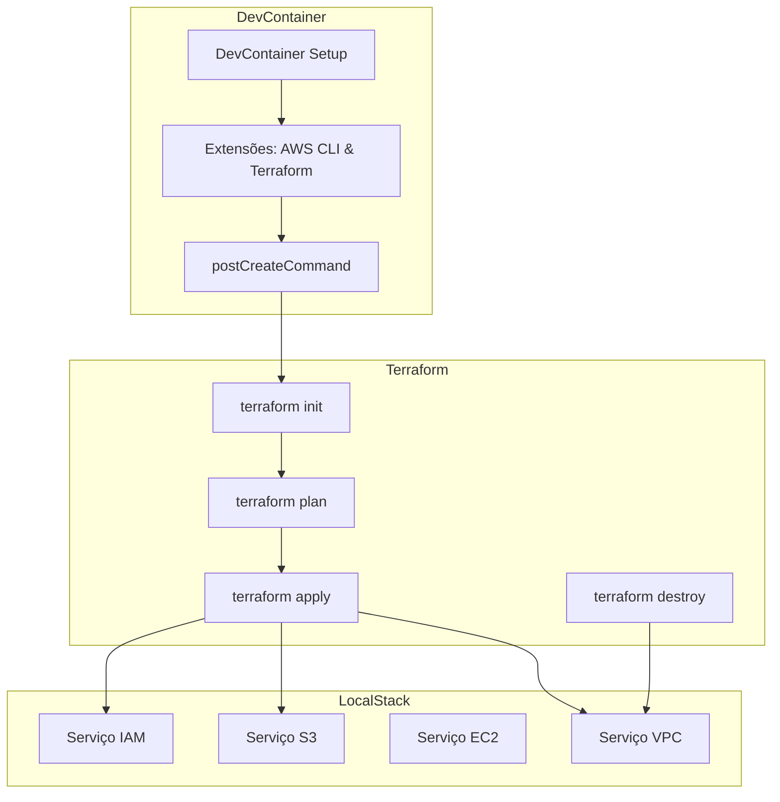

# 🌍 Terraform + LocalStack Dev Environment

Este projeto cria um ambiente **local e seguro** para testar infraestrutura AWS usando **Terraform** em conjunto com **LocalStack**, tudo orquestrado via **DevContainer + Makefile**.

> 💡 Ideal para ambientes de desenvolvimento, testes automatizados e demonstrações sem gerar custos reais na AWS.

---

## ✅ Pré-requisitos

- Docker instalado e rodando
- Visual Studio Code com a extensão **Dev Containers**
- Chave SSH gerada localmente (`~/.ssh/id_rsa.pub`)
- Git para clonar o repositório

---

## 🐳 DevContainer

Este projeto usa um DevContainer com:

- Terraform 1.8.4
- AWS CLI
- LocalStack + awslocal
- Python venv isolado

> Ao abrir a pasta no VS Code, será solicitado automaticamente o **rebuild** no container.

---

## 📁 Estrutura de Arquivos

```
.
├── .devcontainer
│   ├── devcontainer.json
│   └── Dockerfile
├── main.tf              # Configuração principal do Terraform
├── networking.tf        # VPC, Subnet, Gateway etc.
├── security.tf          # Security Group e chave pública
├── outputs.tf           # (opcional) Outputs organizados
├── Makefile             # Comandos automatizados
├── .envrc               # (opcional) Carregamento de env
├── README.md
└── upload_file.py       # upload files from local directory to localStack S3
```

---

## 🧙‍♂️ Comandos Mágicos

Todos os comandos são executados via:

```bash
make <alvo>
```

| Comando           | Descrição                                      |
|------------------|-------------------------------------------------|
| `make up`        | Sobe o LocalStack com Docker Compose            |
| `make down`      | Derruba o LocalStack                            |
| `make tf-init`   | Inicializa o Terraform                          |
| `make tf-plan`   | Gera o plano de execução do Terraform           |
| `make tf-apply`  | Aplica o plano (cria os recursos)               |
| `make tf-destroy`| Destroi todos os recursos criados               |

---

## 🧪 Validações Inteligentes

Antes de qualquer execução de Terraform, o script:

- Valida se o container `localstack` está rodando
- Verifica o status de saúde (`healthy`)
- Testa comunicação via `awslocal s3 ls`

---

## ⚠️ Observações

- A key pública `~/.ssh/id_rsa.pub` **deve existir** no host para o Terraform importar.
- O `main.tf` foi modularizado em arquivos menores (`networking.tf`, `security.tf`) para organização.
- O ambiente **não persiste dados entre reinícios**, a menos que você configure volumes persistentes.
- Adicionamos essa linha para fazer um teste de commit integrado.

---

## 🧜🏻‍♀️ Fluxo Mermaid

